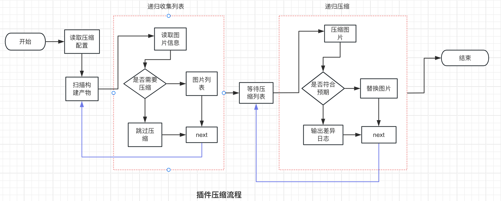
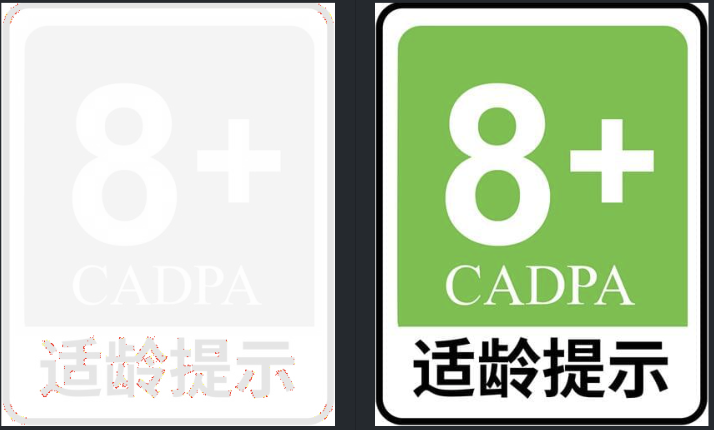

#  Post Compress Image

Post Compress Image 是一款安全、高效的cocos creator图片压缩插件，该插件会在构建之后，对图片资源进行解析和压缩，能够大幅度地缩减游戏包体积大小。



## 安全体现在哪？
插件在压缩过程中，会对压缩前后图片像素差异和文件大小进行对比，若不符合预期，则放弃压缩，从而确保压缩操作的安全性。用户可以自定义设置像素差异值为多少，设置图片差异预期。于此同时，若压缩不符合预期，插件会在`build/img_diff`目录下输出差异日志对比。


## 高效在哪？
插件通过压缩构建产物，即可以避免项目资源的反复压缩，又可以节省人工压缩这一步操作。于此同时，由于插件使用的是`imagemin` 压缩工具，理论上可以兼容所有图片格式。


## 安装步骤
1. 下载：通过商城下载插件到项目；
<br/>

2. 安装依赖：cd 到插件的目录，然后执行`npm  install`命令
<br/>


## 说明
1. 该插件只在cocos creator 2.4.7编辑器投入过生成使用，其他版本的编辑器可能会存在兼容性问题导致插件无法正常使用；
<br/>

2. 若用户可以通过查看`build/diff_images`目录，查看像素对比，从而可以进行相关的二次优化，例如调整自动图集组成元素、以及强制压缩超预期但可接受的图片
<br/>

3. 在插件的代码中，可以自行设置相关的配置参数，相关的配置参数说明如下：
```
const postBuildCompressConfig = { 
    hq: 0.8, // 最高可接受压缩质量
    lq: 0.6,  // 最低可接受压缩质量
    includes: [], // 强制压缩的图片的uuid
    excludes: [], // 需要排除压缩图片的uuids
    threshold: 50, // 像素差异预期值
    platform: {
      native: false, // ios、android打包是否生效
      weixin: false, // weixin打包是否压缩
      web: true, // web打包是否生效
    },
};
```
